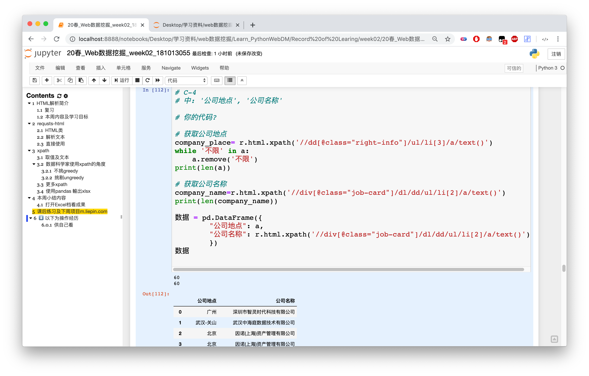

# PythonWebDM-Week02笔记

---

## 本周主要内容

### 1.复习上周requests-html模块内容🐛
 
本周进一步加深对这个模块的学习理解，认识到这个模块在<b>处理、解析</b>html页面的强大，配合 XPATH 使得我们能够更容易获取到网页上的内容。

### 2.XPath语法的使用👀

> XPath 使用路径表达式来选取 XML 文档中的节点或节点集。节点是通过沿着路径 (path) 或者步 (steps) 来选取的。

通过使用XPath语法，我们就可以快速得到想要的位置路径。

[XPath在W3school的描述文档](https://www.w3school.com.cn/xpath/xpath_syntax.asp)


通过几天的项目练习，总结一下流程经验：

1. 先用浏览器开发者工具快速定位到想要的内容的路径
2. 网页一般都是结构化的，就是说有规律可以遵循，找找上下相同板块的标签结构，观察一下
3. 找到离“想要的内容”最近的一个带class的上层标签，然后再逐层往下写
4. 先print测试一下，看看能不能出来内容，不能的话回去再修改一下路径
5. 最后一步就直接赋值ok了


示例代码：

` news_url=r.html.xpath('//div[@class="news_title"]/a/@href')
`

总而言之，最重要的就是多研究观察一下各个节点吧。


### 3.Pandas模块加持输出表格👾

> Pandas是一个强大的分析结构化数据的工具集；它的使用基础是Numpy（提供高性能的矩阵运算）；用于数据挖掘和数据分析，同时也提供数据清洗功能。[更多查看中文文档](https://www.pypandas.cn/)

一言以概之，pandas就是处理数据的模块。

得到数据之后就是一个列表里乱七八糟的字符，利用Pandas模块去处理数据，通过表格展示，让数据变得更加直观易懂。

更多的解释还得看“Python数据处理”课程。

Pandas中创建的列表可以直接用requests-html模块爬取的内容。

示例代码

```

# B-D-1 pd.DataFrame 建构，pandas课有教
df = pd.DataFrame( {
         "标题": r.html.xpath('//div[@class="news_title"]/a/@title'),
         "链结": r.html.xpath('//div[@class="news_title"]/a/@href'),
         "日期": r.html.xpath('//font[@class="right-more"]/text()'),
     } )
df

```

### 练习🥳

本周的课后练习挺有意思的嘿嘿，通过3道题目来爬取网页指定内容来巩固学习。

#### 练习1🧐

此题为最简单的题目。直接通过路径可以爬到，还不会报错。


#### 练习2🤯

这道题还是有难度的，爬所有的公司名称这个不难。

但是因为有liepin推广广告的存在，需要删掉广告栏目。（真实公司名称跟广告公司名称有不一样的标签）

通过观察研究发现，广告的公司地点都是带“不限”的，所以用了一个循环来删除所有“不限”，才能对应上公司名称。

tips：在尝试的时候，多用len函数来看看爬到的两个数目是否相同。




#### 练习3🤯🤯🤯

说实话，这道题，搞了我相当长的时间。放弃了几次，最后在复习的时候突然开窍才完成的。

刚开始我以为，我以为跟第四题一样能够通过筛选删除就解决了，后面我筛选了几次之后才发现，有些公司根本没有！！！没有url！！不得不说廖主任、超哥实在是高啊。

变换思路想着既然没有url，能不能通过填充一个值如“NaN”表示没有呢，按道理是可以的，但是经过几个小时的一番操作，结果行不通，也找了很多很多有关pandas的函数啊，报错啊之类的，反正就是数目对不上。技术方面的问题。奈何自己太菜了，哎。

然后在第二天下午复习时，无意看到一段代码能够获取同一个标签\层级里的内容和url的，结果一试。。。。。。🐂啊！！就好了！！！有了这个就能够获取到了。

后面就是筛选数据的活了，一是删除广告的时间（带“1分钟前”的），二是经验里面学历（带“学历不限\xa0经验不限”的），在处理学历这一块，因为页面布局需要，爬下来的数据带了很多换行符（’\n‘），就查找了相关的方法删掉了（原理看不太懂哈哈哈哈哈三个键解决问题😁）


---

还是挺有意思的，就是有点耗头发哈哈哈哈哈

📦源码[链接🔗](https://github.com/Autumnhui/Learn_PythonWebDM/blob/master/Record%20of%20Learing/week02/20%E6%98%A5_Web%E6%95%B0%E6%8D%AE%E6%8C%96%E6%8E%98_week02_181013055.ipynb)


